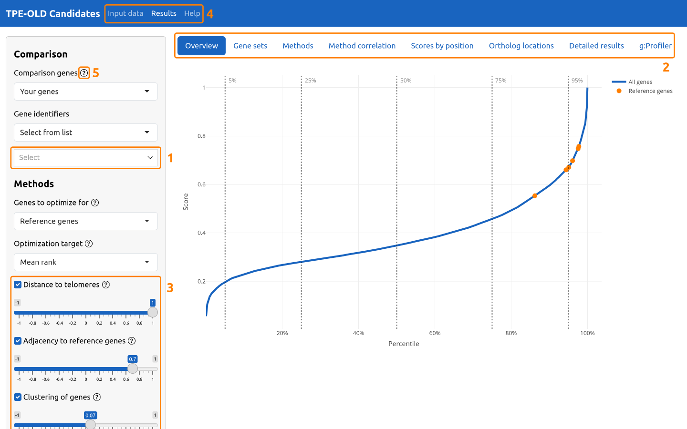
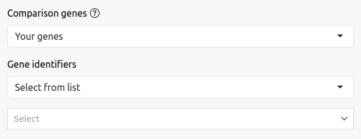
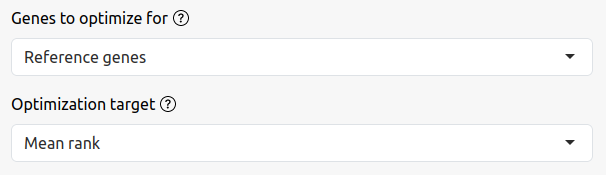
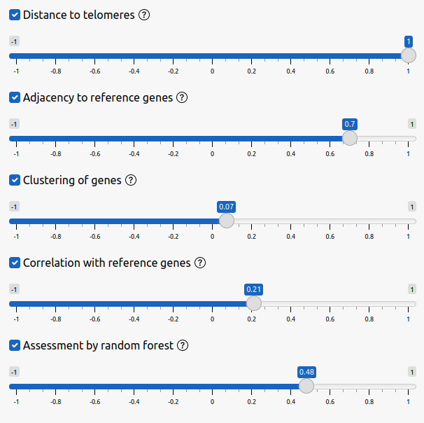
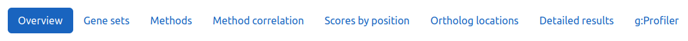
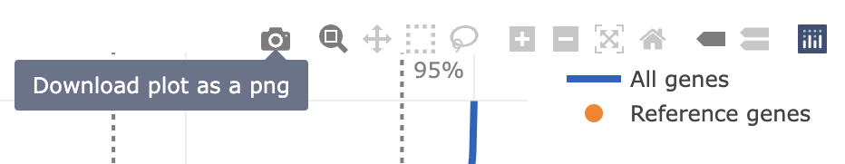
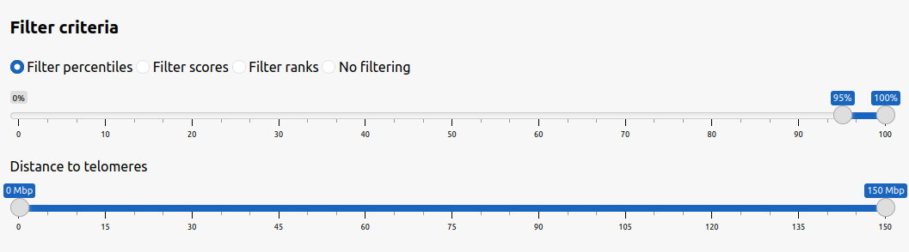
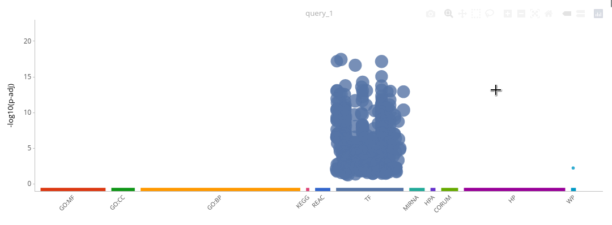

## Introduction

This web interface provides an interactive tool to analyze genes based on their position across species. Specifically, it can be used to investigate the effect of telomere length on gene regulation. Telomeres are repetitive DNA sequences at the end of chromosomes that shorten with every cell division. The regulation of a number of genes has been reported to depend on the length of telomeres. Gene positions across species can be a valuable dataset for analyzing effects like this because genes that are regulated by position effects may exhibit patterns in the position of their orthologs.

It is possible to use this tool to analyze any set of reference genes. Most likely, you are currently visiting [tpe-old.uni-rostock.de](https://tpe-old.uni-rostock.de/), which is preconfigured based on genes affected by TPE-OLD (telomere position effect over long distances). This is a specific way in which telomeres can influence gene expression by forming long-distance loops.

Information on TPE-OLD is still limited. By providing this tool, we hope to direct the community towards genes that may be more likely than others to experience a controlled telomeric interaction, based on patterns in their chromosomal position across species. Comparing your genes of interest with the reference ranking may unveil new candidates for TPE-OLD that could be a valuable target for further experimental investigation.

## Overview

These are the five most important things in the user interface:

**1** – This is where you can select your genes of interest. 
**2** – The tab bar gives access to different visualizations and results. 
**3** – This section can be used to toggle the different methods and to set the weights. 
**4** – Navigating to the "Input data" is only neccessary when you want to use the method to study another set of reference genes. 
**5** – When you need help, click these icons to get information on the controls.

## How to Get Help

This document describes the general concepts of the user interface and commonly used features. Please also note the context-sensitive help made available via the "?" next to many controls. If your use case does not match the scenarios described in this document, please <a href="https://github.com/johrpan/geposanui/issues" target="_blank">open an issue on GitHub</a>.

## Results Page

The "Results" page is the landing page for this website. Most of the interactions will take place there and it is also the starting point for examining your genes of interest. You can customize the computation of the combined ranking and dynamically generate different visualizations and results.

### Gene Selection

Use the controls in top left to select your genes of interest. The choices are:

**Random genes** – A randomly selected set of genes to become familiar with the system without any biological input. 
**Established TPE-OLD genes** – Genes for which a TPE-OLD effect was experimentally confirmed. These are the reference genes for the default preset. 
**Suggested TPE-OLD genes** – Genes for which a TPE-OLD effect was proposed but not experimentally confirmed. 
**Your genes** – Select this to use your own genes of interest.

After selecting "Your genes" you can choose how you want to enter the genes. By default, you can interactively choose from the menu below. It is also possible to paste HGNC symbols or Ensembl gene IDs. A text field will appear after selecting the respective identifier type instead of "Select from list".

### Method Weights

The combined ranking is computed by combining the scores of the individual methods. To make this system more flexible, methods can be enabled/disabled and weighted differently. By default, the weights are determined automatically based on an optimization process. This step can be customized using the controls above the weight sliders.

#### Genes to Optimize for

For the majority of users, the default setting will involve reference genes, carefully chosen to represent a specific biological feature of interest (highlighted in orange) - typically the TPE-OLD effect. However, users also have the option to submit a set of custom genes (highlighted in green). In such cases, to observe how the ranking is influenced by scoring prepared specifically for this custom gene set, the system provides the option for ad hoc optimization on the selected "Comparison genes".

#### Optimization Target

The reference genes (default) or custom genes (if selected above) will be evaluated based on their scores, which are determined by the weights assigned to each method. Users have several options to guide this weight optimization:

**Mean rank** – Aiming for the highest possible average score assignment. 
**Median rank** – Striving for optimal performance of the gene positioned in the middle. 
**First rank** – Prioritizing the best-performing gene. 
**Last rank** – Focusing on improving the performance of the worst-performing gene. 
**Customized weights** – Allowing users to adjust the weights according to their preferences.

#### Custom Weights

The sliders in the bottom left can be used to manually adjust the weights for the individual methods. Use the check boxes to quickly enable or disable a single method. The optimization will still be performed based on the new set of methods, but you can also use the sliders to change the weights yourself.

### Result Tabs

The tabs on the Results page show different visualizations and results. All plots show the reference gene set in orange and the genes selected by the user in green. Most tabs include information to help you with interpreting the data.

#### Using the Interactive Plots

The interactive visualizations rely on the JavaScript library "plotly". The top-right of those plots provides a set of controls. These can be used to change the visualization and to download the plot as a PNG. The reference genes are always shown in orange and the user selected comparison genes are shown in green. Hovering the mouse pointer over these markers will reveal information on the genes.

#### Downloading the Dataset

Use the "Detailed results" tab to get access to the complete dataset. Before downloading the dataset, you can use the filter controls to limit the tabular data to only include top ranking genes or to investigate genes in a specific range of telomeric distances. Select "No filtering" to view or download the complete dataset.

The detailed results table is interactive and can be used to get more information on individual genes. Use the search entry to look for specific genes by their HGNC symbol. By clicking on the gene symbol, you can view it in the Ensembl genome browser, which also includes links to other databases. Use the buttons below to copy or download the filtered (or complete) dataset as shown in the table.

#### g:Profiler Integration

[g:Profiler](https://biit.cs.ut.ee/gprofiler/gost) is a tool for performing gene set enrichment analyses. Using the same filter controls as described above, you can analyze top ranking genes for specific biological annotations. Please refer to the documentation of g:Profiler for more information on this method and its implementation.

## Input Data Page

The input data page can be used to customize the dataset and configuration for the method as a whole. If you are interested in analyzing your genes of interest in the context of the ranking, you do not have to change the reference genes. Instead, please use the controls on the "Results" page to select the comparison genes.

#### Species to Include

The presented results are computed based on all available species in Ensembl that have a chromosome-level assembly available. However, it is possible to limit the dataset to a predefined set of species by selecting "Customize". Select the species from the input field below. Normally, you should not limit the number of species without a specific reason because it is always better to have a larger dataset available.

A basic requirement for the different methods to work is to have access to the functional and evolutionary equivalent genes, i.e. orthologs, in different species. Because of that, species are automatically excluded if they do not have orthologous genes for at least 50% of the already established set of genes to analyze. The quality of the assembly of a genome is important, since for yet unassembled fragments the distances to the ends of the chromosomes cannot be interpreted as a distance to a telomere.

It should also be noted that the number of orthologs depends on the set of species already selected. This means that it is not possible to exclude species a priori.

#### Reference Genes

The reference genes are the main input to the computation. Some of the individual methods will compare the data of candidate genes to this gene set and it will be used to perform the automatic optimization of the method weights to derive the combined ranking. All visualizations will show the reference genes in an orange color.

## References

A paper accompanying this web interface and the underlying methods is currently under peer review.

This project is based on data from [Ensembl](https://www.ensembl.org/index.html).

The software for this project is developed using the [R programming language](https://www.r-project.org). The web interface is implemented as an R package ([geposanui](https://github.com/johrpan/geposanui)) based on our implementation of the underlying methods ([geposan](https://github.com/johrpan/geposan)). The following additional R packages have been essential tools for the development of this project:

 - [biomaRt](https://bioconductor.org/packages/release/bioc/html/biomaRt.html) for data retrieval
 - [data.table](https://rdatatable.gitlab.io/data.table/) for efficient handling of large datasets
 - [DT](https://rstudio.github.io/DT/) for interactive display of tabular data
 - [gprofiler2](https://biit.cs.ut.ee/gprofiler/page/r) for gene set enrichment analyses
 - [plotly](https://plotly.com/r/) for interactive visualizations
 - [ranger](http://imbs-hl.github.io/ranger/) for implementing the random forest method
 - [shiny](https://shiny.posit.co/) for building the web interface

## Acknowledgements

We thank all our users for their encouragement and feedback, special thanks go to our colleagues at the Institutes for [Clinical Chemistry and Laboratory Medicine](https://ilab.med.uni-rostock.de/) and [Biostatics and Informatics in Medicine and Aging Research](https://ibima.med.uni-rostock.de) in Rostock. The service is hosted on a cloud instance generously provided by the [Rostock University ITMZ](https://www.itmz.uni-rostock.de/), for which we are grateful.
